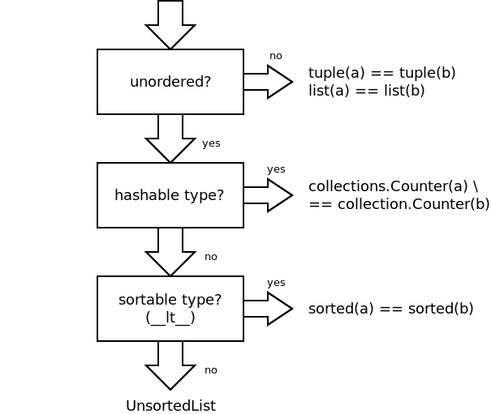

# Python UnorderedList

An UnorderedList implements comparisons between mutable lists of objects
that can be compared with each other ignoring the sequence of objects.
The class does not require members to implement a hash and always does
deep comparisons (`__eq__`).

## When to use

The class should be used if you have a list-type for which holds that:

- The list is unordered
- Items are not immutable and not hashable (`__hash__`)
- Items are not orderable (`__lt__`)

If any of the above mentioned criteria are not fulfilled, it is more
efficient to use Python standard types to accomplish comparisons:



## How to use

The class `UnorderedList` is implemented in a single python file and
can be used like any other regular list:

```python
from unordered import UnorderedList

l = UnorderedList([1, 2, 3, 4])\

for i in l:
   print(i)
# 1
# 2
# 3
# 4

print(l == UnorderedList([4, 1, 2, 3]))
# True

```
